# Wanikani Heatmap

This addon adds a a panel to the Wanikani dashboard which gives you a good overview of your
past and present studies through heat maps of your reviewing and learning efforts as well as related stats.

To use this addon you first and foremost need to have a [Wanikani](wanikani.com) account. Once you are logged in you can
then install a script management extension such as [Tampermonkey](https://www.tampermonkey.net/), then
install the dependency [Wanikani Open Framework](https://community.wanikani.com/t/installing-wanikani-open-framework/28549),
and then lastly install [Wanikani Heatmap](https://greasyfork.org/en/scripts/377336-wanikani-heatmap). Once you have
followed these steps, a heat map element should then appear on your dashboard. If you have a lot of reviews to load
(if you have used Wanikani for a long time), it may take a few minutes for these to be fetched from Wanikani's API.

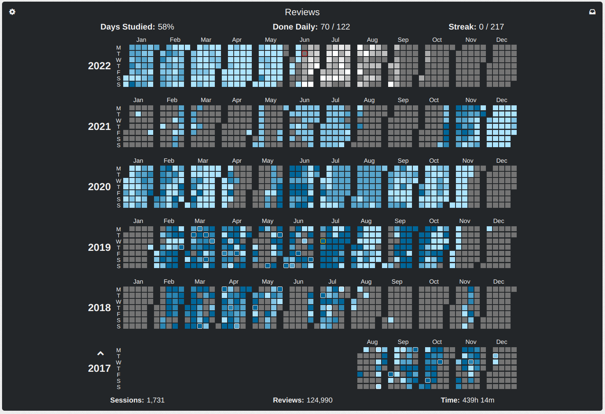

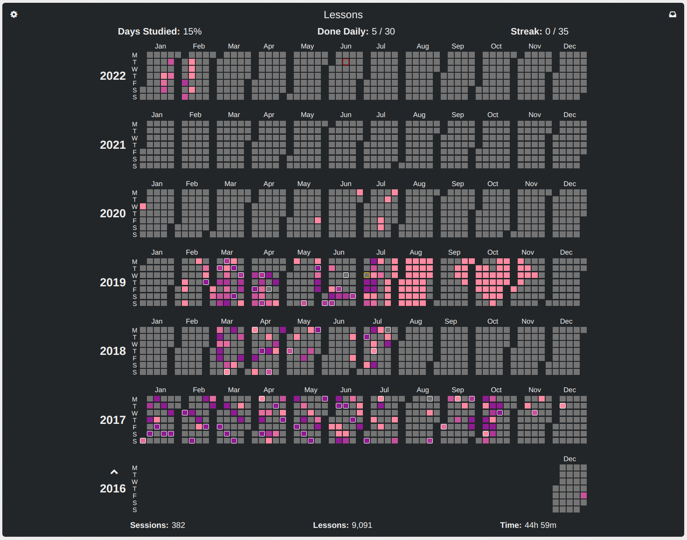

## Basic usage

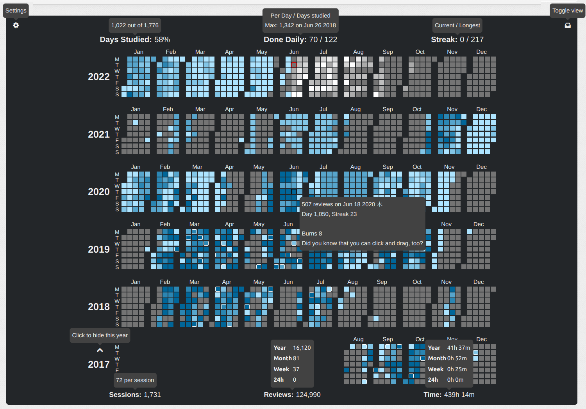

Though this addon has a lot of features, the most important thing for a user to know about is the ability to toggle
between the reviews and the lessons heat maps. At the very top of the component you will see one button in the left
corner and one button in the right corner. The button on the left will take you to the settings, while the button to
the right will switch between reviews and lessons. 

The essential feature of this addon is the heat map. There is a heat map for every year of your studies so that you can
get a good overview of your studying habits. In the heat maps every square represents a single day, the color of which 
is determined by how many reviews or lessons you did on that day. If you hover over one of these cells it will tell you
exactly how many you did, as well as some other interesting information. The days with white borders around them are 
marked as days on which you leveled up. The day with the red border is today. You will notice that there are some
colored days after the current day in the reviews heat map; these days show forecasted reviews which you are scheduled 
to see in the future. If you do not wish to have all the years displayed at all times, you can
simply hide years by clicking on the arrow above the year label. Similarly you click on the arrow below the year to 
show a previously hidden year. 

Each of the reviews and lessons views show a number of different stats. If there is anything which seems unclear, you
can always put your cursor over it and a message will pop up to give you some extra information. At the top and bottom we have the 
basic stats of your history with either reviews or lessons. This will tell you how consistent you have been (days studied),
how much effort you have put in (done daily), your current streak, how many review or lessons sessions you have completed,
how many total reviews or lessons you have completed, and the time you have spend doing reviews or lessons. 

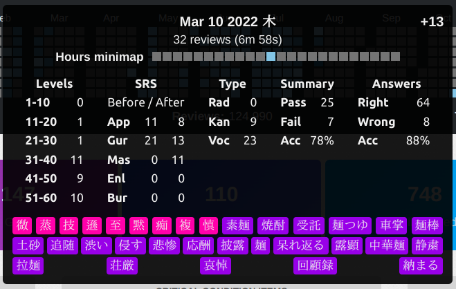

Additionally, if you want more detailed stats on a single day you can click on it to bring up a pop-up element with more information.
You can also click and drag to select a range of days to get more information about. This popper contains a number of 
additional stats, such as

- Net Progress: The number in the top right displays the net number of SRS levels you progressed on this day, or in this time frame
- Total number of reviews or lessons
- The time you spent
- A mini heat map for the hours of the day
- The levels of the items you reviewed or did lessons for
- The SRS distribution of the items you reviewed, before and after the reviews 
- The type distribution of the review items or lessons
- The review summary
- The answer summary
- All the items reviewed or learned
    - These items can be hovered over to display more information about the item

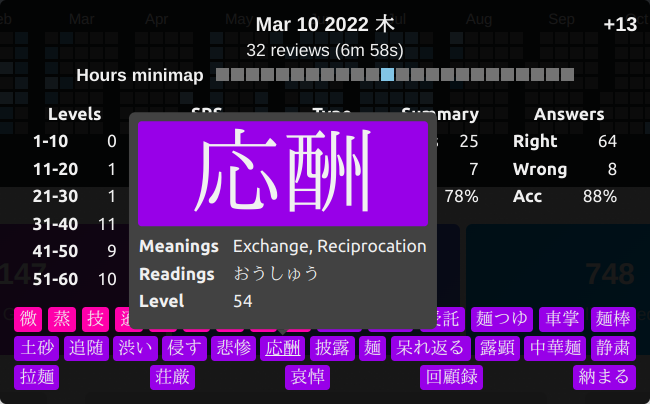

## Settings

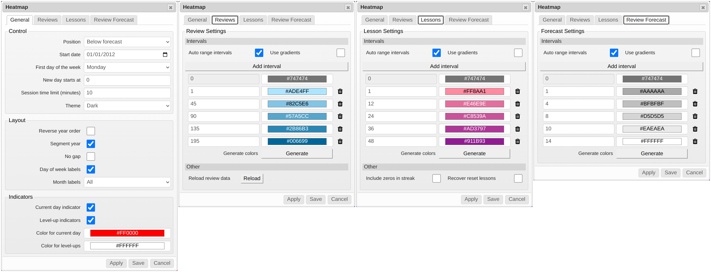

This addon features a lot of settings to customize the experience to the user. Since this is a very visual addon, a lot
of these settings are cosmetic. However, there are also some key functional settings as well. 

First, let us take a look at the general settings tab. Here we have three groups of settings: control, layout, and indicators.

- Control
    - Position: This lets you choose where on the dashboard you want the heat maps to be displayed
    - Start Date: If you want to exclude some data you can manually set a start date. The addon ignores all data from before this date
    - First Day of the Week: Choose which day of the week you want to be represented by the top row in the heat maps
    - New Day Starts At: If you tend to stay up late at night you may want reviews done after midnight to count towards the day before. Use
    this setting to adjust when you want a new day to start.
    - Session Time Limit: This setting is used to calculate how much time you spent doing your reviews and lessons, as well
    as how many sessions you have conducted. If you go this number of minutes between reviews, they are counted as different sessions.
    - Theme: You can choose between different color themes. Available options are light (default), dark, and Breeze Dark.
- Layout
    - Reverse Year Order: Displays the most recent years at the bottom instead of the top
    - Segment Year: Adds a gap between each month
    - No Gap: Removes gaps between days
    - Day Of The Week Labels: Whether to display labels for days of the week
    - Month Labels: Choose where, or if, to display month labels
- Indicators
    - Current Day Indicator: Display a border around the current day
    - Level-Up Indicator: Display a border around the days on which you leveled up
    - Color for Current Day: Color of the border around the current day
    - Color for Level-Up: Color of the border around level-up days

In the reviews, lesson, and forecast tabs we have very similar settings.

- Auto Range Intervals: Create suitable ranges for your colors based on your history
- Use Gradients: Choose the color of each day as an interpolation of your closest intervals (this will make your heat map smoother)
- Add Interval (button): Click to add another interval
- Interval (multiple): Pick a lower bound and a color for your interval
- Generate Colors (button): Click to interpolate colors for the middle intervals from the first and last non-zero interval
- Reload (reviews only): Reload the review cache
- Include Zeros (lessons only): Let days with no lessons available to be done count towards your streak
- Recover reset lessons (lessons only): If you have reset your level in the past the lesson data for reset items is lost forever.
This feature attempt to recover lesson data from your review history, which remains after resets. Not completely accurate.

# Examples

Here are some example heat maps provided by the community

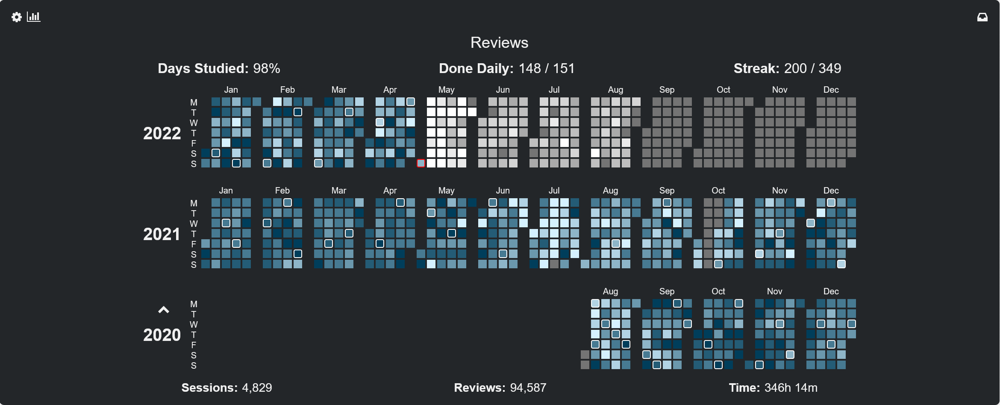

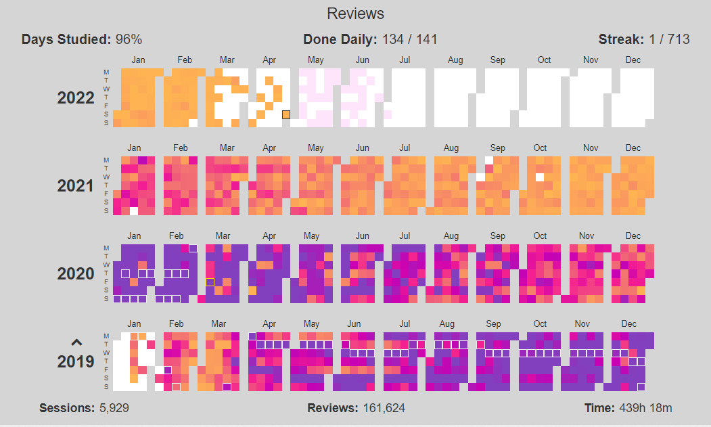

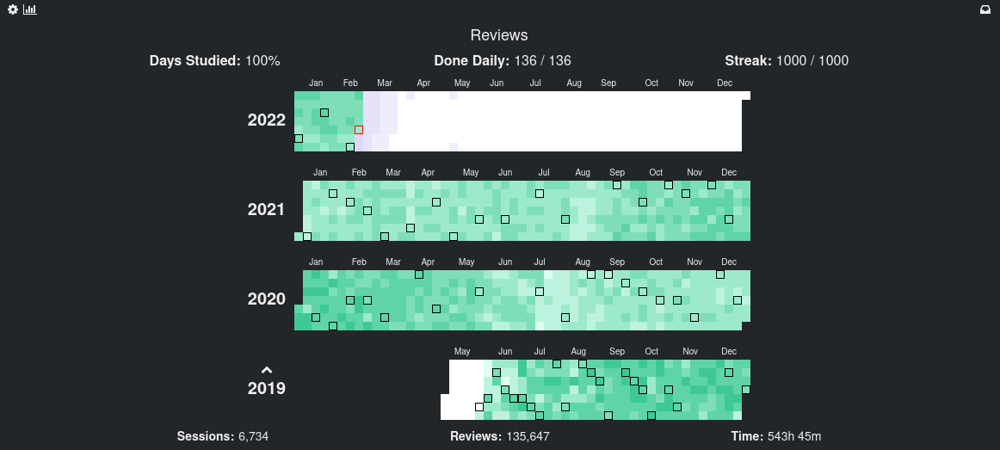

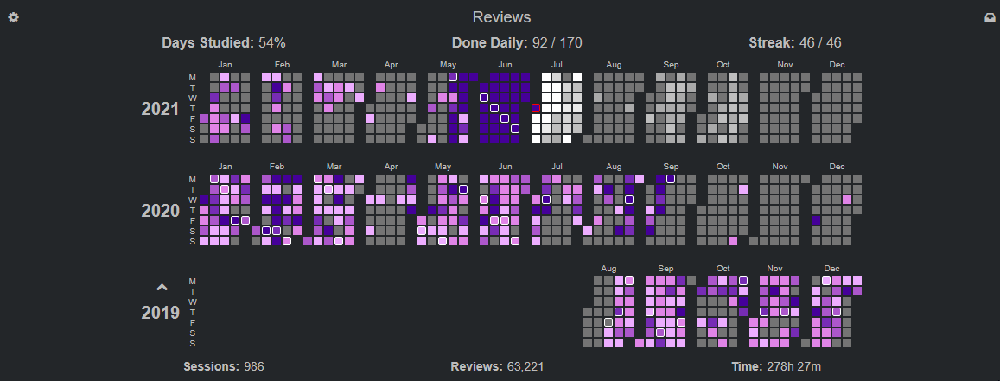

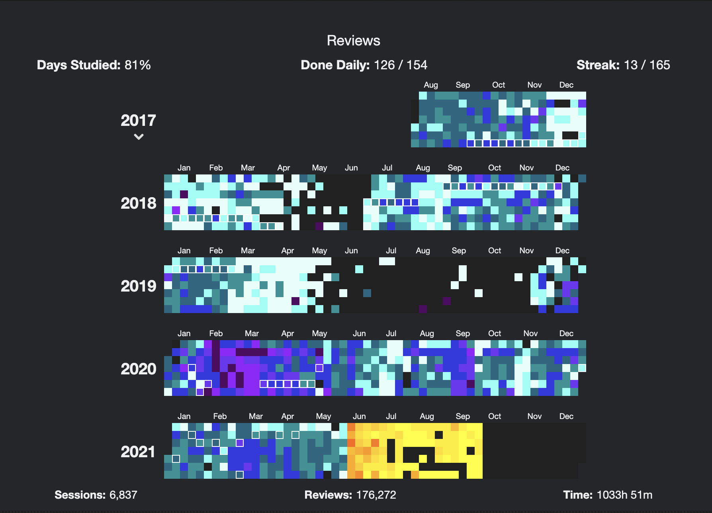

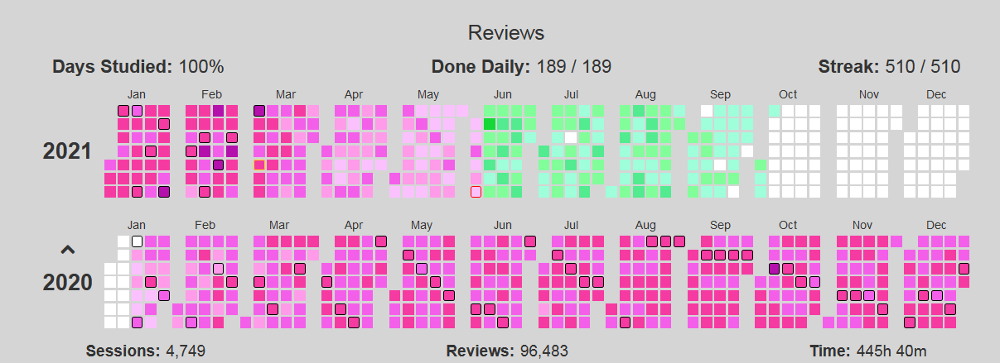

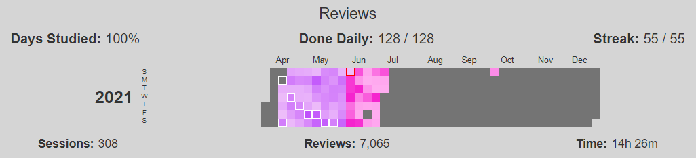

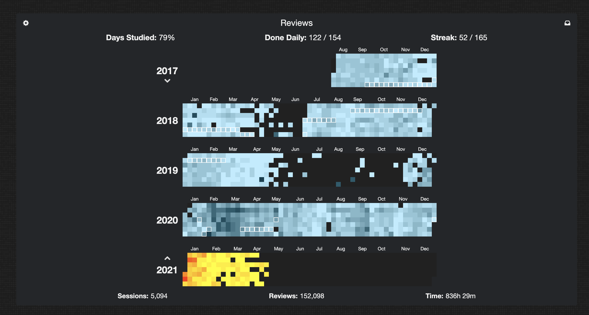

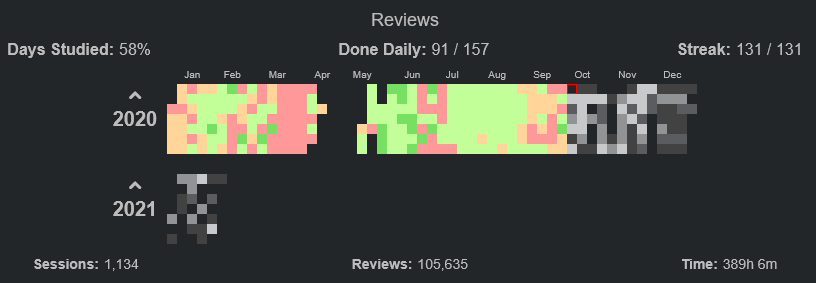

